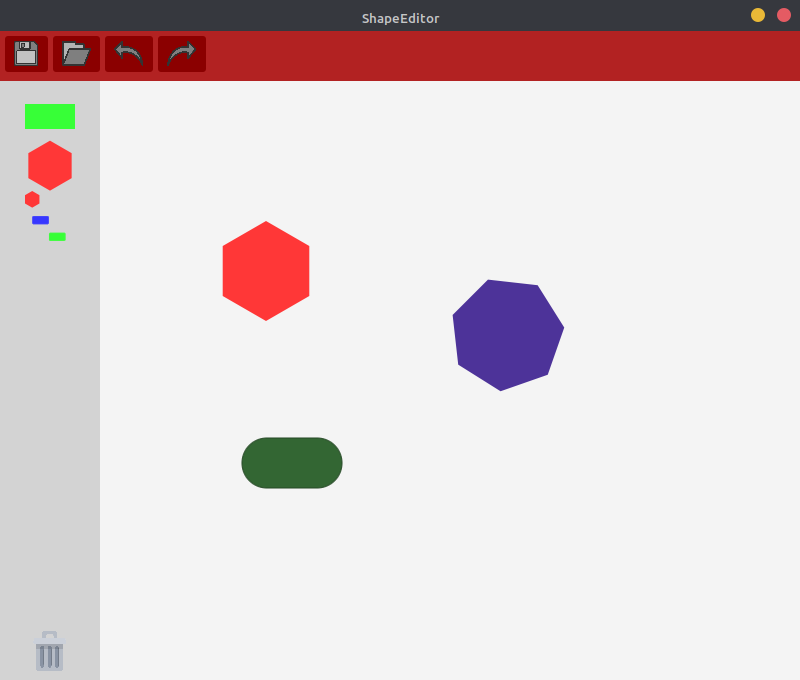

# ShapeEditor
A simple shape editor that embeds different design patterns in Java. This editor contains features explained below, but the main goal 
was to create a software that could easily be extended. That's why we used a lot of Design Patterns, to allow other developers to extend the features, and facilitate maintenance.

  

## Run
This project has been developed with Java 11. To build this project, you will have to add the following libraries :
- [JavaFx 11](https://gluonhq.com/products/javafx/)
- [JSON Simple](https://code.google.com/archive/p/json-simple/downloads)
- [JUnit 4](https://github.com/junit-team/junit4/wiki/Download-and-Install)
Note : It can be built using Java 8 (in which JavaFx is integrated)

## Features
This editor embeds the following  features :
- Drag and Drop to create, move or delete shapes
- Create Group of shapes, group of groups, etc.
- Dissociate groups
- Edit Shapes (color, size, rotation, etc.)
- Add Shapes or groups in the toolbar
- Undo/Redo
- Document save and load
- Automatic toolbar save and load

We added some other features :
- Delete or add to toolbar selected shapes (without being a group originally)
- Edit a group
- Safety on toolbar save/load (if there is no more rectangle or polygon, a new instance will be added automatically)
 
 ## Design Patterns
 - Creation
   - Singleton
   - Prototype
   - Factory Method
 - Structural
   - Composite
   - Bridge
 - Behavior
   - Mediator
   - Observer
   - Memento
   - Visitor
